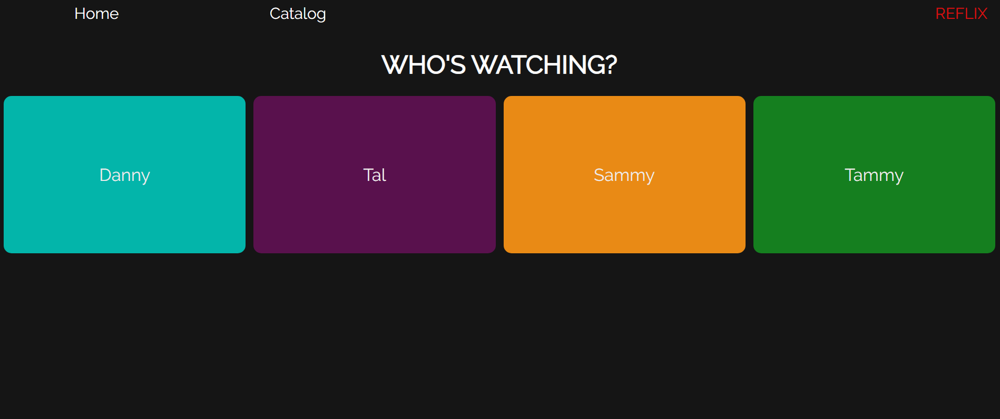
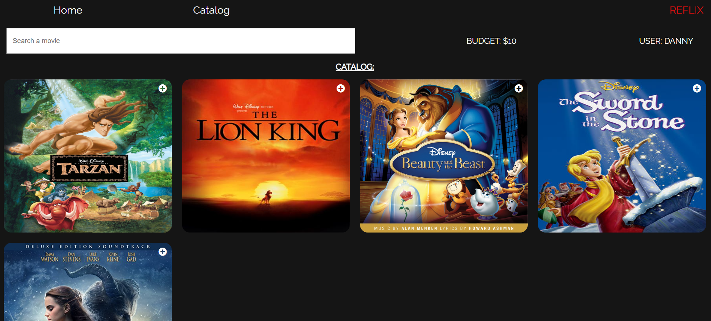
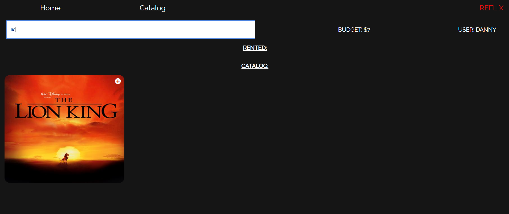
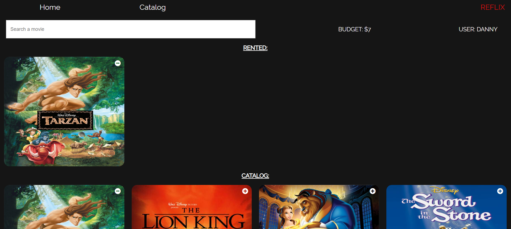
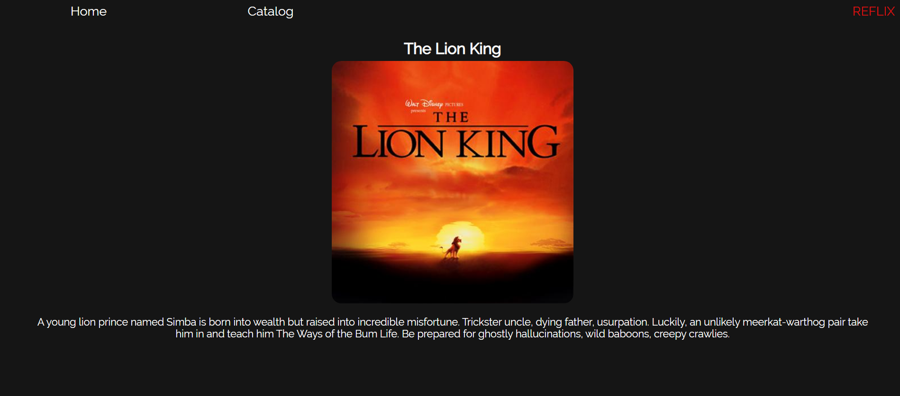

# Reflix

Reflix is a front end movie rental app built with React. Users are able to choose their user and rent movies based on their budget. Each user has a unique budget. Users can also click on the movie to see more information about the movie.

Demo: [https://dannys-reflix.herokuapp.com/](https://dannys-reflix.herokuapp.com/)

## Table Of Contents
- [Reflix](#reflix)
  * [Running the project](#running-the-project)
  * [Screenshots](#screenshots)
    + [Select User](#select-user)
    + [Movie Catalog](#movie-catalog)
    + [Search Filter](#search-filter)
    + [Rented Movies](#rented-movies)
    + [Movie Details](#movie-details)
  * [Tech Stack](#tech-stack)
  * [TODO](#todo)

## Running the project
1. Clone the repo.
2. Run `npm install`.
3. Run `npm start`.
4. Navigate to `http://localhost:3000` (or other port based on the message in the console).

## Screenshots

### Select User
Main screen for user to select who they are.

### Movie Catalog
A user can see their budget and all the available movies to rent.

### Search Filter
As a user searches the movie catalog filters the movie based on the name.

### Rented Movies
Once a user rents a movie/s a new 'Rented' section appears on the page showing which movies they have rented.

### Movie Details
A user can click on a movie to see more information about the movie.

## Techstack
1. React

## TODO
1. Get many movies from movie API.
2. View movies by category.
3. Persist rented movies with local storage.
4. Create full stack with NodeJS, Express, Mongo.